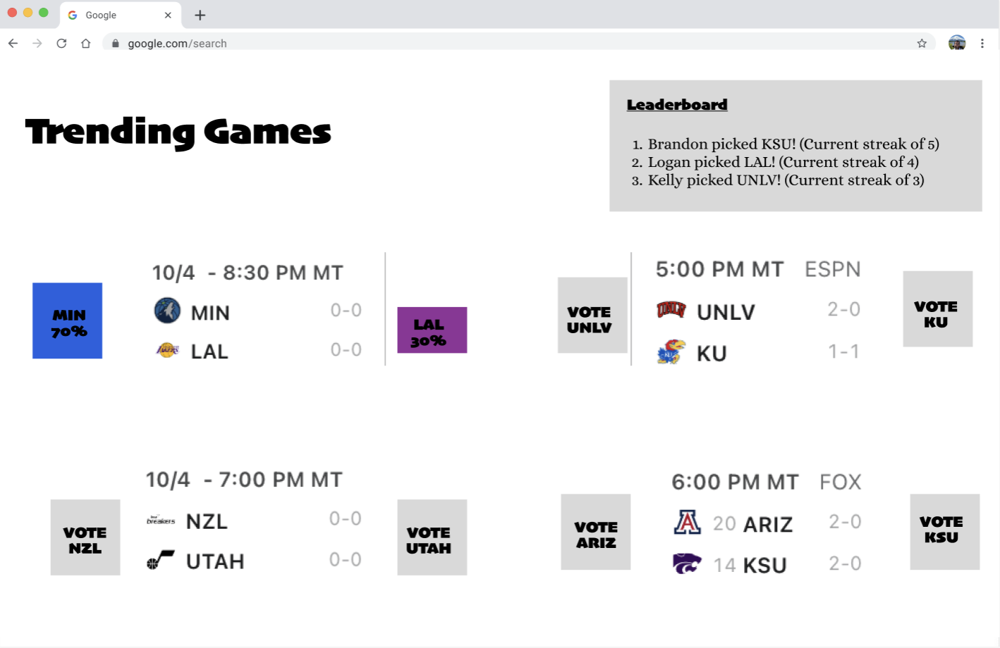

# FanVote

## Elevator Pitch
FanVote brings the excitement of live sports to your fingertips by letting you vote in real-time on who you think will win upcoming and ongoing games. Whether it's soccer, basketball, or any other major sport, users can see live updates, engage in friendly competition with others, and track the accuracy of their predictions. FanVote transforms sports watching into an interactive experience, making it fun to see how your votes stack up against your friends and the rest of the world. 

## Design Sketches
**Sign In Page**

**Vote Page**

## Key Features
- Secure login over HTTPS
- Ability to select team to vote for
- Display of live and upcoming games to choose from
- Streak of correct games predicted displayed on leaderboard to all users in real time
- Unique user profiles**
- User results persistently stored on their profile
- Real time voting results displayed after vote is placed
- Game Data Auytomatically fetched from [third party API](https://developer.sportradar.com/getting-started/docs/coverage-information)

## Technologies Overview
- **HTML**
- kljflakjfsdlkj
- **CSS**
- **JavaScript**
- **React**
- **Service**
- **DB/Login** 
- **WebSocket**

