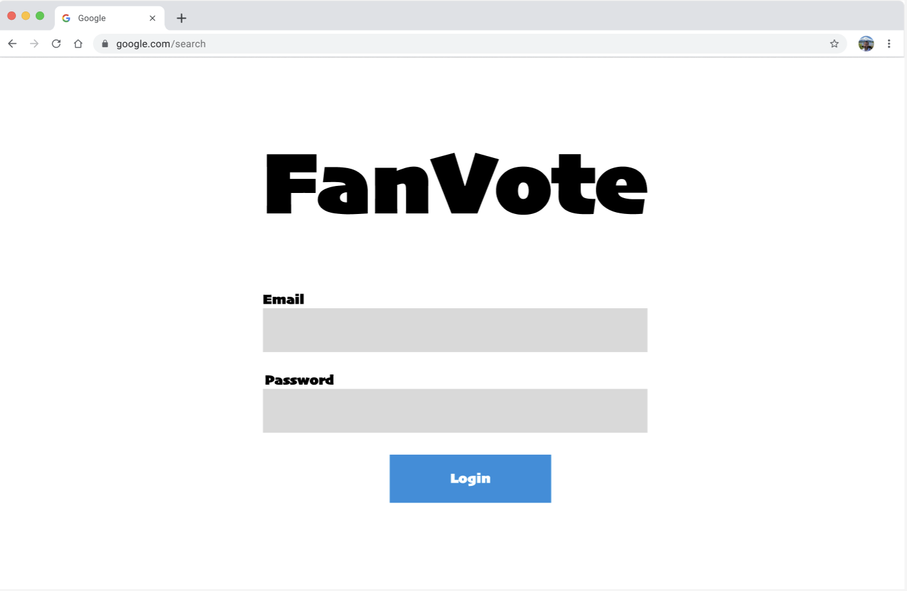
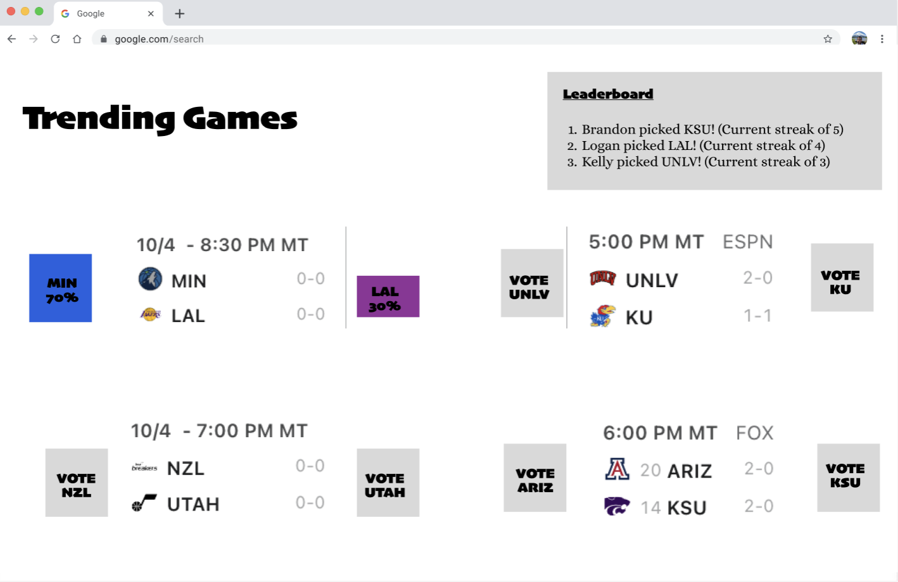

# FanVote

## Elevator Pitch
FanVote brings the excitement of NBA action to your fingertips, letting you vote on who you think will win upcoming basketball games. Engage in friendly competition with fellow fans and see how your predictions stack up against your friends and basketball enthusiasts worldwide. FanVote transforms following the NBA into an interactive and fun experience.

## Design Sketches
**Sign In Page**

**Vote Page**

## Key Features
- Secure login over HTTPS
- Ability to select team to vote for
- Display of upcoming NBA games and ability to predict the outcome of each
- Recent Votes shown on the prediction page with live updates when other users place predictions
- Unique user profiles
- User predictions persistently stored on their profile
- Real time predictions displayed when they are made
- NBA Game Data Auytomatically fetched from [third party API](https://developer.sportradar.com/getting-started/docs/coverage-information)

## Technologies Overview
- **HTML**
    - Will provide structure for login page and voting page
- **CSS**
    - Will provide styling for application to ensure that it displays correctly on varying screen types
    - Will enable good spacing, color choice, and contrast
- **JavaScript**
    - Provides login, choice display, enables voting, displays votes to other users, backend endpoint calls
- **React**
    - Single page application with views componentized and reactive to users actions
    - Framework ties together HTML, CSS, and Javascript for interactive frontend
- **Service**
    - Backend Service endpoints for retrieving votes and submitting votes
    - Displays upcoming NBA games using the [The Sports DB](https://www.thesportsdb.com/) service
- **DB/Login** 
    - Stores users, votes, and vote history
    - Users can register and login 
    - Credentials are stored in a database
    - Authentication required in order to vote
- **WebSocket**
    - When a user votes, their vote is shown to all users. There is also a display showing recent votes placed to all users in real time

# HTML Deliverable
For this deliverable, I built out the structure of my application using HTML.

- [x] **HTML Pages**: My application contains 3 HTML pages. There is a login page where users can create an account or login. It also contains a description of FanVote. There is a predictions page where users can see upcoming games, a prediction streak leaderboard, their account name, a navigation menu, a basketball picture banner, and they can place their votes for who they think will win each game. There is also an account page where users can see their prediction history, the email they registered their account with, another basketball banner picture, and a navigation menu.
- [x] **HTML Tags**: All three pages use html tags properly, including BODY, NAV, MAIN, HEADER, FOOTER.
- [x] **Links**: The login page automatically links to the predictions page. There is a navigation menu on the predictions and accounts pages that links to the home/login page, the predictions page, and the accounts page. I've also included a link to my GitHub repository at the bottom of each page.
- [x] **Text**: Each of the prediction choices is represented by a textual description. There is also a textual description of what FanVote is on the login page.
- [x] **Third Party Service Calls**: Each image of an upcoming game is a placeholder of a third-party service call that will be used to populate upcoming NBA games to be voted on from [the Sports DB](https://www.thesportsdb.com/).
- [x] **Images**: There are 2 different Basketball banner images, one on the predictions page and one on the account page.
- [x] **DB/Login**: An input box and submit button are provided for login. The prediction history on the account page represents data pulled from the database and displayed to the user.
- [x] **WebSocket**: The leaderboard on the predictions page shows where a WebSocket will be used to show a leaderboard in real time of the longest correct prediction streaks.

# CSS Deliverable
For this deliverable I properly styled the application into its final appearance using CSS.

- [x] **Header, footer, and main body content**: My header, footer, and main body content are properly styled.
- [x] **Navigation Elements**: There are properly styled and functional navigation elements in the top right of both the predictions and account pages. 
- [x] **Responsive to window resizing**: All elements of the web page, including images and grid elements, resize with the window and are responsively styled and designed
- [x] **Application Elements**: All application elements have good contrast and whitespace.
- [x] **Application Text Content**: I used consistent fonts and text colors.
- [x] **Application Immages**: All application images are responsively designed and have a border. They resize with the size of the window.

# React Deliverable
For this deliverable I used JavaScript and React so that the application completely works for a single user. I also added placeholders for future technology.

- [x] **Bundled and Transpiled**: Done!
- [x] **Components**: I created an app component, an account component, a login component, a predictions component, and index component, a gameCard component, and a voteRow component. 
    - [x] **login**: When you press the login button it takes you to the predictions page
    - [x] **database**: On the accounts component, I display a voting history of the user's 5 most recent predictions made. This is currently done through local storage but will be done through the database later. I also keep a tally of predictions made in the same way
    - [x] **WebSocket**: My websocket is not currently a component. I have placeholder data in my  Recent votes box on m y predictions page
    - [x] **Processing Votes**: I use local storage to save predictions users make on the site, making the predicting aspect of the application essentially functional. I also display a message saying "Vote submitted" whenever a user submits a prediction 
- [x] **Router**: Routing between login and prediction and account components
- [x] **Hooks**: I use UseState and UseEffect in my prediction and account components. UseState is used to keep track of whether or not a vote has been submitted and useEffect refreshes the vote history in localStorage each time a new prediction is made  

# Service 
For this deliverable I added backend endpoints that receive predictions and return prediction history and the number of predictions the user makes. I also used [the Sports DB](https://www.thesportsdb.com/)'s API to pull in data of upcoming NBA games that refreshes every hour to ensure that upcoming NBA games are always available to be predicted.

- [x] **Node.js/Express HTTP service**: Done!
- [x] **Static middleware for frontend**: Done!
- [x] **Calls to third party endpoints**: I called [the Sports DB](https://www.thesportsdb.com/)'s API in my frontend to obtain data for upcoming NBA games. This data was then populated in my gameCard component to enable user's to vote on who they think will win each upcoming game. I set an interval to call the API each hour to ensure that the upcoming games are up to date
- [x] **Backend service endpoints**: Placeholders for login that stores the current user on the server. I created endpoints to get user's predicitons and to post their predictions as well
- [x] **Frontend calls service endpoints**: My frontend calls my endpoints to store user predictions and to retrieve user predictions from the back end to display user predicitons on the account component